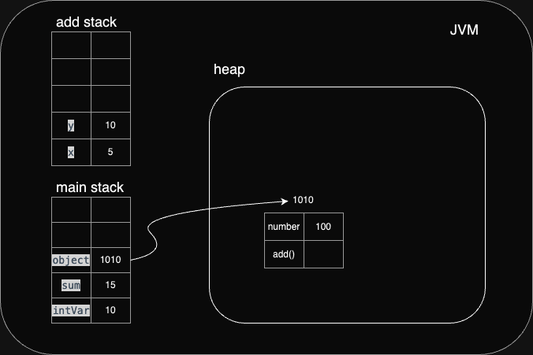
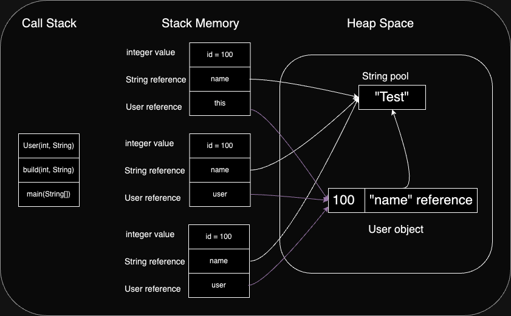

# __Java Memory Management__

## Stack and Heap

## Stack

- The stack follows the Last In, First Out (LIFO) principle.
- It's used for storing temporary data like method calls and local variables.
- Faster to allocate in comparison to variables on the heap.
- Usually has a maximum size already determined when your program starts.

## Heap

- The heap is used for dynamically created objects and arrays.
- The heap has a larger memory space compared to the stack.
- Operations involving dynamic memory allocation and deallocation take more time.
- Heap memory space is managed by the Garbage Collector (GC), which cleans up unused objects.

## Differences

- **Data Structure:** Stack follows Last In, First Out (LIFO), Heap follows min-heap or max-heap property.
- **Speed:** Stack is faster due to simpler memory management.
- **Memory Size:** Stack is limited, Heap has a larger memory space.
- **Memory Management:** Stack memory is static and automatic, while Heap memory is dynamic and managed by the Garbage Collector.

## How it Works

1. The program starts by executing the `main` method of the `Main` class.
2. A local variable named `intVar` is created with a value of 10.
3. An instance of the `StackExample` class is created and assigned to the `object` variable.
4. The `add` method is called via `object`, with 5 and 10 as parameters.
5. Within the `add` method, a class variable named `number` is printed to the console. This variable is allocated in memory when an instance of the `StackExample` class is created and each instance has its own value.
6. The `add` method returns the result of the `x + y` operation.
7. This return value is assigned to the `sum` variable and printed to the console.

## User Builder

